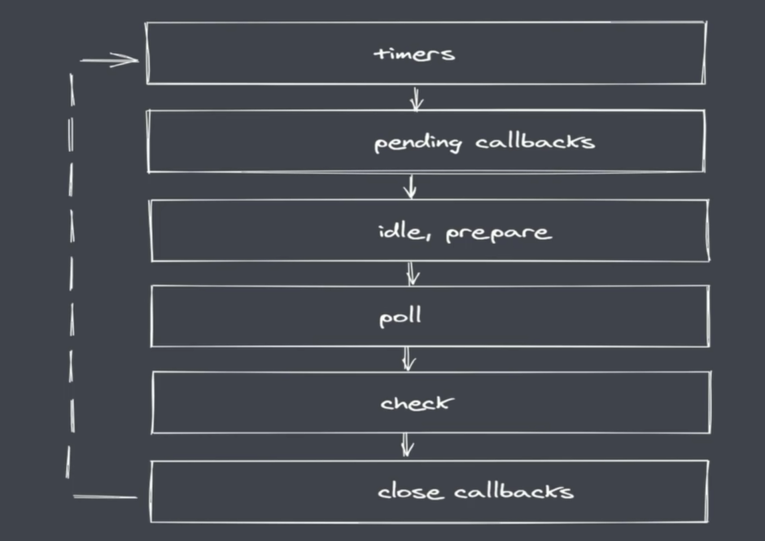

## nodejs中事件循环机制

- ### timers: 执行setTimout与setInterval回调
- ### pending callbacks: 执行系统操作的回调，如tcp udp
- ### idle, prepare: 只在系统内部进行使用
- ### poll: 执行I/O相关的回调
- ### check: 执行setImmediate中的回调
- ### close callbacks: 执行close事件的回调

### nodejs完整事件循环
- #### 执行同步代码，将不同的任务添加至相应的队列
- #### 所有同步代码执行完后执行满足条件的微任务
- #### 所有微任务执行后执行timer队列中满足的宏任务
- #### timer中**所有的宏任务执行**完成后就会依次切换队列
- #### 注意：在完成队列切换之前会清空微任务队列

### 浏览器与nodejs中的事件循环的区别

##### 任务队列数不一样
- ##### 浏览器中只有两个任务队列
- ##### nodejs中排除微任务队列，还有6个事件队列

#### 微任务执行时机
- ##### 两者都会在同步代码执行完毕后执行微任务
- ##### 浏览器下每当执行完一个宏任务就会清空微任务
- ##### nodejs下在事件队列切换时才会去清空微任务

#### 微任务优先级
- ##### 浏览器中，微任务存放于事件队列中，先进先出
- ##### nodejs中process.nextTick先于Promise.then

#### nodejs事件循环中常见问题
##### setTimeout与setImmediate的执行顺序是不确定的，因为setTimeout就算为0，但是也会受其他因素的影响

##### 但是如果将setTimeout和setImmediate放在I/O的回调中，则setImmediate一定先于setTimeout执行，因为根据nodejs事件循环，I/O事件队列执行后，下一个执行的是setImmediate事件队列